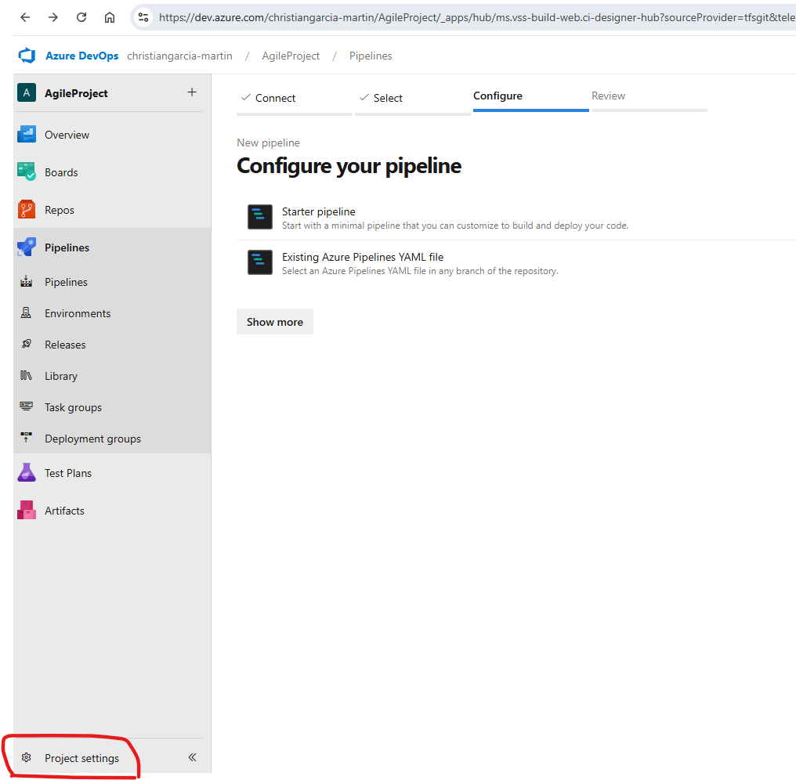
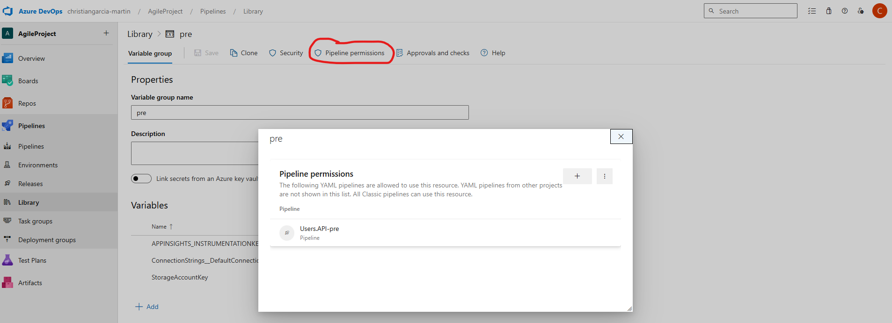

1 Create host agent

follow instructions to create agent locally and connect it by devops token

2 Create a pipeline
you need to add your host agent in the .yml

3 Create service connection

you need to create a app registration in azure and save:
- CLIENT ID
- TENANT ID
- SECRET
  
  

4 Create variable group in the library

- add the value
- as a secret
- or from a keyvault

5 Enable release for your project in organization level

6 Create release

use it with "." or with ":" 
sample : Azure.ApplicationInsights.InstrumentationKey

use this option if your app read vars from env vars and not from appsettings.json

save and create release

